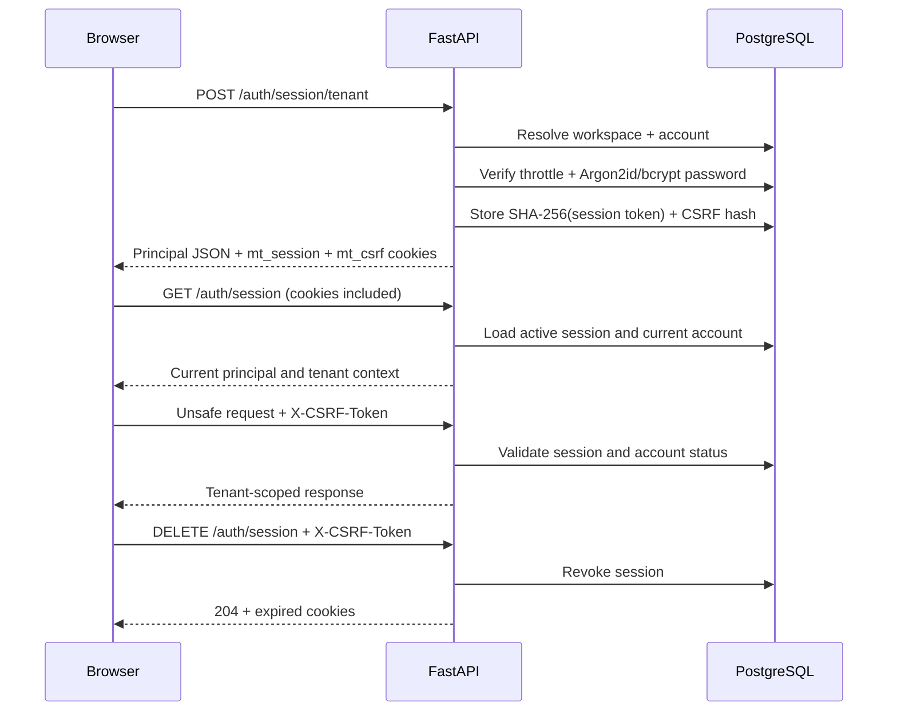

# Authentication architecture

This application supports two authentication transports without mixing their
responsibilities:

- API clients and Swagger use the existing signed bearer JWT.
- The React application uses an opaque browser session in an HttpOnly cookie.

The backend remains the authority for identity, tenant scope, role, and account
status. Frontend route guards improve navigation but never replace backend
authorization.

## Account hierarchy

| Account | Creation path | Login path |
|---|---|---|
| Platform Admin | `scripts.seed_platform_admin` only | Platform session login |
| Tenant Admin | Created atomically with a tenant | Organization-member login |
| Project Manager | Created by a Tenant Admin | Organization-member login |
| Employee | Created by a Tenant Admin | Organization-member login |

Tenant users never select a role during sign-in. They provide a workspace slug,
email, and password; the authenticated database record supplies the role.

## Browser-session flow



Only token hashes are persisted. The raw session token is available solely in
the HttpOnly cookie, and React never reads or stores it. The CSRF cookie is
readable so the API client can echo it through `X-CSRF-Token` on unsafe
requests.

## Public browser-session API

| Method | Path | Body or result |
|---|---|---|
| `POST` | `/auth/session/platform` | `{email, password}` |
| `POST` | `/auth/session/tenant` | `{workspace_slug, email, password}` |
| `GET` | `/auth/session` | Current principal and tenant context |
| `DELETE` | `/auth/session` | Revokes the session and clears cookies |

The two existing bearer endpoints remain available at `/auth/admin/login` and
`/auth/login`.

## Validation boundaries

Creation and password-change boundaries enforce the strong password policy:

- 12–128 characters;
- at least one uppercase letter, lowercase letter, number, and special
  character;
- not a common password;
- does not contain the account email, name, organization, or workspace slug.

Sign-in validates only that a password is present and no longer than 128
characters. Reapplying creation-time strength rules during sign-in would lock
out valid legacy accounts. Passwords are never trimmed, normalized, echoed in
validation responses, or logged.

Emails are trimmed, lowercased, validated, and stored with PostgreSQL `CITEXT`
semantics. A tenant's `workspace_slug` is unique, lowercase, 3–63 characters,
contains only letters, digits, and single hyphen separators, and cannot start
or end with a hyphen.

## Abuse and transport controls

- Account throttle: five failures per 15 minutes.
- IP throttle: twenty failures per 15 minutes.
- Lock duration: fifteen minutes.
- Unknown tenants and accounts perform dummy password verification.
- Credential failures intentionally share one generic response.
- Cookie-authenticated unsafe requests require a matching CSRF cookie/header.
- Request bodies are capped before route parsing.
- Production responses include CSP, HSTS, frame, MIME-sniffing, referrer, and
  permissions protections.

Expired and revoked sessions plus stale throttle counters are removed by the
idempotent maintenance command:

```powershell
Set-Location backend
python -m scripts.cleanup_auth_state
```

Schedule it periodically outside request handling so cleanup does not add
latency or lock contention to login.

## Frontend module boundaries

The frontend uses one-way feature dependencies:

```text
pages -> features -> entities/shared
```

- `app/` owns routing and providers.
- `pages/` composes route-level screens.
- `features/auth/` owns login forms and authentication operations.
- `entities/session/` owns principal state and role routing.
- `shared/api/` owns transport, cookies, and normalized API errors.
- `shared/ui/` and `shared/styles/` contain reusable presentation primitives.

During development, Vite serves the UI and proxies `/api` to FastAPI. In
production, serve the UI and `/api` behind one origin so browser cookies remain
same-site and credentialed CORS is unnecessary.

If `CSRF_COOKIE_NAME` is changed on the backend, set the frontend build-time
`VITE_CSRF_COOKIE_NAME` to the same value.

## Trusted reverse proxies

IP throttling uses `request.client`, after Uvicorn has canonicalized it. The
application deliberately ignores arbitrary `X-Forwarded-For` values. Behind a
reverse proxy, start Uvicorn with `--proxy-headers` and an explicit
`--forwarded-allow-ips` allowlist containing only the proxy IP/CIDR. Do not
trust `*` on a publicly reachable server. A bad allowlist either makes all
clients share the proxy's throttle identity or permits clients to spoof it.

## Test layers

- `backend/tests/test_*.py` covers schemas, password policy, middleware, cookie
  semantics, redaction, and transport rules.
- `backend/tests/integration/test_postgres_auth.py` creates a disposable PostgreSQL
  database, migrates from `0001` to head, and exercises real HTTP/session,
  migration, uniqueness, legacy rehash, throttling, expiry, cleanup, and
  bearer-compatibility behavior.
- Frontend Vitest tests cover form behavior, the API client, restoration, and
  route guards.
- Frontend Playwright tests cover tenant/platform screens, every role route,
  failure/lockout/expiry/logout states, keyboard-visible controls, and browser
  storage safety.
